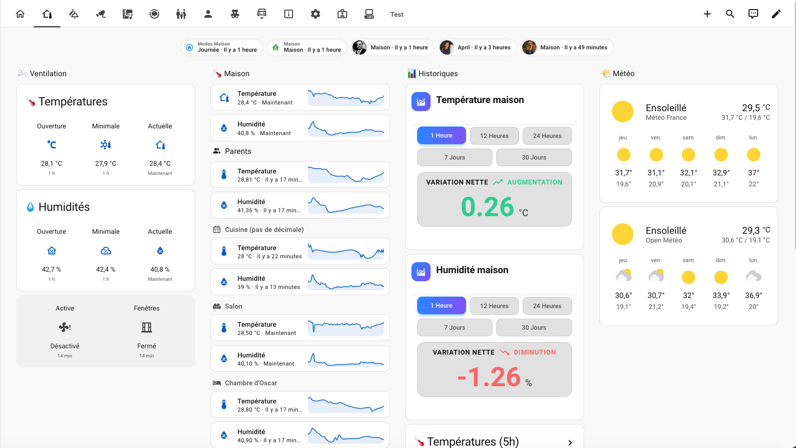

# Home Assistant – Domotique Familiale 🏠

Configuration Home Assistant complète d'un foyer à Lyon : automatisations, scripts, dashboards Lovelace et intégrations MQTT/n8n pour piloter éclairages, présence, confort, notifications et routines familiales.

> Une maison qui s'occupe des détails, pour que la famille n'ait pas à y penser.

## 

## 📑 Table des matières

- [Présentation](#-présentation)
- [Fonctionnalités principales](#-fonctionnalités-principales)
- [Stack technique](#-stack-technique)
- [Architecture](#-architecture)
- [Exemple d'automatisation](#-exemple-dautomatisation)
- [Sécurité & données personnelles](#-sécurité--données-personnelles)
- [Installation](#-installation)
- [Historique de conception](#-historique-de-conception)
- [Contribution](#-contribution)
- [Licence](#-licence)

---

## 🎯 Présentation

Ce dépôt contient l'ensemble de la configuration **Home Assistant** utilisée au quotidien pour gérer la domotique d'un foyer avec enfants :

- 💡 **Éclairages intelligents** : luminosité et température de couleur adaptées à l'heure et à la pièce
- 🌡️ **Confort thermique** : gestion automatique de la climatisation selon l'ouverture des fenêtres, suivi des températures
- 👨‍👩‍👧 **Présence & sécurité** : activation/désactivation d'alarme selon qui est présent, notifications de retour à la maison
- 🔔 **Notifications intelligentes** : questions interactives sur mobile (oui/non), rappels vocaux (TTS), gestion multi-destinataires
- 🗣️ **Diffusion vocale (TTS)** : rappels d'école, agenda familial, fun facts pour enfants, routines du soir/coucher
- 📊 **Intégration n8n** : réception de webhooks (ex. résumé budgétaire hebdomadaire) et diffusion automatique en TTS/notification

Chaque automatisation ou script complexe est accompagné d'un fichier `.md` documentant son fonctionnement, ses entrées/sorties et sa logique — pensé pour rester compréhensible même après plusieurs mois sans y toucher.

---

## ✨ Fonctionnalités principales

1. **Automatisations d'éclairage contextuel** : luminosité/température ajustées automatiquement selon la pièce et le moment de la journée, avec boutons physiques dédiés par chambre.
2. **Gestion de présence avancée** : détection d'arrivée/départ, notification interactive ("Oscar est-il seul à la maison ?") avec réponse par bouton mobile, activation automatique de l'alarme selon le contexte.
3. **Automatisations de confort** : mémorisation de la température à l'ouverture des fenêtres, alerte en cas de remontée de chaleur, pilotage automatique de la climatisation selon les ouvertures.
4. **Routines familiales en TTS** : rappels d'horaires d'école (départ/fin, fun facts), agenda familial (quotidien et vacances), histoire du soir, rappel de douche et de coucher.
5. **Notifications robustes** : script générique de diffusion (mobile, TTS, MQTT) avec gestion du volume, choix du son (ex. jingle SNCF avant les rappels d'école), et questions interactives avec timeout.
6. **Intégration MQTT** : envoi de SMS via passerelle MQTT (JPI), gestion des topics par destinataire.
7. **Webhook n8n** : réception d'un résumé budgétaire hebdomadaire, diffusion automatique en notification persistante et TTS.
8. **Dashboards Lovelace dédiés** par membre de la famille et par usage (éclairages, confort, multimédia, sécurité, réglages, accueil invités).

---

## 🔧 Stack technique

### Cœur

- **Home Assistant** : plateforme domotique open source, configuration 100% YAML
- **Jinja2** : templating pour la logique conditionnelle, les triggers dynamiques et la personnalisation des messages
- **YAML** : configuration déclarative (automatisations, scripts, scènes, dashboards)

### Intégrations

- **MQTT** : communication avec les appareils et passerelle SMS (JPI)
- **Google Assistant** : exposition d'entités pour le contrôle vocal
- **n8n (webhooks)** : réception d'événements externes (résumés budgétaires) déclenchant des actions Home Assistant
- **Text-to-Speech** : diffusion vocale sur enceintes connectées (Google Home)

### Outils de développement

- **Continue** (`.continue/rules/`) : règles IA spécialisées Home Assistant (automatisations, Lovelace, MQTT, Zigbee2MQTT, ESPHome)
- **GitHub Copilot** (`.github/copilot-instructions.md`) : conventions de nommage, structure documentaire, workflow de contribution

---

## 🏗️ Architecture

```
automatisations/    # Automatisations YAML (déclencheurs → conditions → actions)
├── lights-*.yaml           # Éclairages par pièce
├── presence-*.yaml         # Présence, alarme, synchronisation
├── confort-*.yaml          # Climatisation, fenêtres, température
├── mode-*.yaml             # Modes maison (auto, présent/absent, horaires scolaires)
├── multimedia-*.yaml       # Ampli, TV, vidéoprojecteur
├── tts-*.yaml              # Rappels vocaux (école, agenda, coucher, douche)
└── *.md                    # Documentation associée à chaque automatisation complexe

scripts/             # Scripts réutilisables, appelables depuis n'importe quelle automatisation
├── notify-*.yaml           # Notifications génériques (mobile, question interactive)
├── tts-*.yaml               # Génération et diffusion de messages vocaux
├── facts-random.yaml        # Fun facts aléatoires pour enfants
└── *.md                     # Documentation associée

includes/            # Configuration modulaire incluse depuis configuration.yaml
├── sensor.yaml, binary_sensor.yaml, cover.yaml
├── mqtt.yaml, google_assistant.yaml
├── input_number.yaml, input_datetime.yaml
└── templates.yaml

lovelace/            # Dashboards par membre de la famille et par usage
├── famille.yaml, oscar.yaml, eliott.yaml
├── confort.yaml, lumieres.yaml, multimedia.yaml
└── informations.yaml, invite.yaml, reglages.yaml
```

### Principe de conception

- **Scripts réutilisables plutôt que logique dupliquée** : `script.notify_send_notifications`, `script.tts_send_message` ou `script.notify_ask_mobile` sont appelés depuis de nombreuses automatisations plutôt que réécrits à chaque fois.
- **`choose` plutôt que des automatisations multiples** : la logique conditionnelle complexe (ex. gestion de présence) est centralisée dans une automatisation avec des branches `choose`, pour éviter les automatisations qui se chevauchent.
- **Nommage kebab-case préfixé par fonction** (`tts-`, `lights-`, `presence-`, `confort-`) pour retrouver rapidement un fichier par domaine.

---

## 💡 Exemple d'automatisation

Diffusion d'un fun fact vocal, avec gestion automatique du volume et exclusion de certaines pièces :

```yaml
# Diffuser un fun fact à un enfant
- action: script.facts_random
  response_variable: fact_result
- action: script.tts_send_message
  data:
    media_player: media_player.ni_oscar_ni_parents
    message: "Il est {{ time }}. {{ fact_result.fun_fact }}"
    sncf: false
```

Le script `tts_send_message` gère en interne le choix du son d'introduction (ex. jingle SNCF avant un rappel d'école), l'ajustement du volume, et la diffusion sur le ou les bons appareils.

---

## 🔐 Sécurité & données personnelles

Ce repo a fait l'objet d'un nettoyage volontaire avant publication :

- Toutes les valeurs sensibles (emails, mots de passe, numéros de téléphone, IPs locales, URL d'accès distant, identifiants de webhook) sont soit passées par le mécanisme natif `secrets.yaml` de Home Assistant (non commité), soit remplacées par des valeurs neutres directement dans les fichiers concernés.
- `configuration.yaml` et certains fichiers contenant encore des données de configuration propres au foyer (`includes/rest_command.yaml`, plusieurs dashboards Lovelace, les workflows n8n) sont volontairement exclus du dépôt via `.gitignore`.
- Ce dépôt est donc une **référence d'architecture et de patterns**, pas une configuration clé en main : il manque volontairement les fichiers d'inclusion de base pour préserver la confidentialité du foyer.

Pour réutiliser ces automatisations chez toi, remplace les entités (`person.*`, `media_player.*`, `input_boolean.*`) par les tiennes, et crée ton propre `secrets.yaml` pour les valeurs sensibles.

---

## 🚀 Installation

Ce dépôt n'est pas une installation Home Assistant complète (il manque volontairement des fichiers de configuration de base, voir section précédente). Pour t'en inspirer :

1. Explore `automatisations/` et `scripts/` pour comprendre les patterns utilisés
2. Copie l'automatisation ou le script qui t'intéresse dans ta propre configuration Home Assistant (`automations.yaml` ou `scripts.yaml`)
3. Adapte les `entity_id` à ton installation
4. Si l'automatisation référence un `!secret`, ajoute la clé correspondante dans ton propre `secrets.yaml`
5. Vérifie la configuration via **Outils de développement → YAML → Vérifier la configuration**

---

## 🤖 Historique de conception

**Développement assisté par IA, environnement VS Code**

- **GitHub Copilot Pro (VS Code)** : assistance principale au développement, avec sélection de modèles selon les besoins et les coûts : GPT-5.3-Codex, Claude Sonnet 4.6, Gemini 3 Flash, GPT-5.4, GPT-5.4 mini, GPT-5 mini
- **OpenAI Codex (VS Code)** : utilisation avec GPT-5.5 via forfait gratuit pour génération et refactorisation de code
- **Claude (Anthropic)** : utilisation de Sonnet 4.6 via forfait gratuit pour raisonnement, architecture et refactorisation complexe
- **Gemini (Google)** : utilisation de Gemini 3.5 Flash et 3.1 Pro via forfait gratuit pour assistance alternative et vérification de solutions
- **Continue** (`.continue/rules/`) : règles spécialisées Home Assistant pour guider les suggestions IA sur les automatisations, dashboards et intégrations

Cette approche hybride combine plusieurs environnements IA afin d'optimiser la qualité du code, la rapidité de développement et la diversité des suggestions.

---

## 🤝 Contribution

### Conventions

- Nommage kebab-case avec préfixe fonctionnel (`tts-`, `lights-`, `presence-`, `confort-`, `mode-`, `multimedia-`)
- Documentation systématique (`.md`) pour toute automatisation ou script non trivial
- Privilégier les entités et intégrations natives avant tout code personnalisé
- Éviter la duplication : passer par un script réutilisable plutôt que copier une séquence d'actions

### Documentation

- **[.github/copilot-instructions.md](./.github/copilot-instructions.md)** : conventions détaillées et workflow de contribution
- **[.continue/rules/](./.continue/rules/)** : règles pour assistants IA (Home Assistant, MQTT, Zigbee2MQTT, ESPHome, Lovelace)
- Un fichier `.md` accompagne chaque automatisation/script complexe dans `automatisations/` et `scripts/`

---

## 📚 Licence

MIT

---

**Fait avec ❤️ pour une maison un peu plus intelligente**
